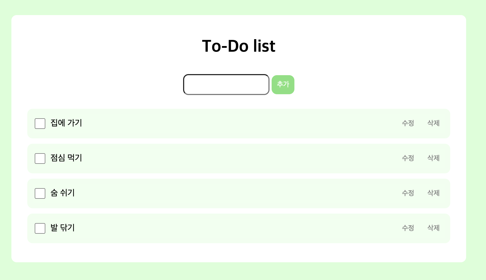
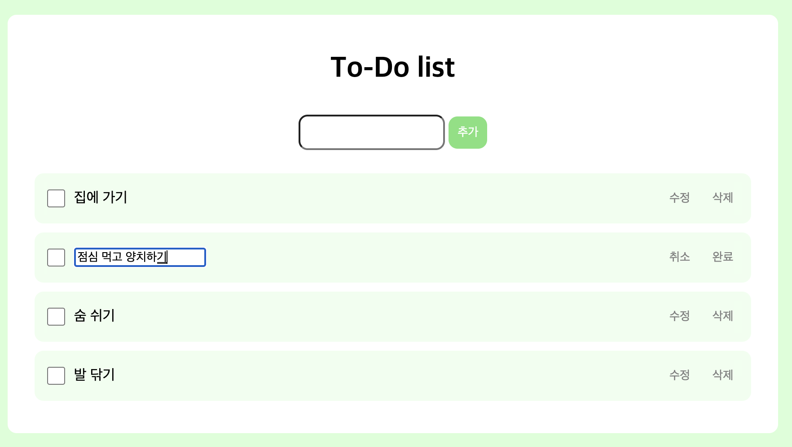
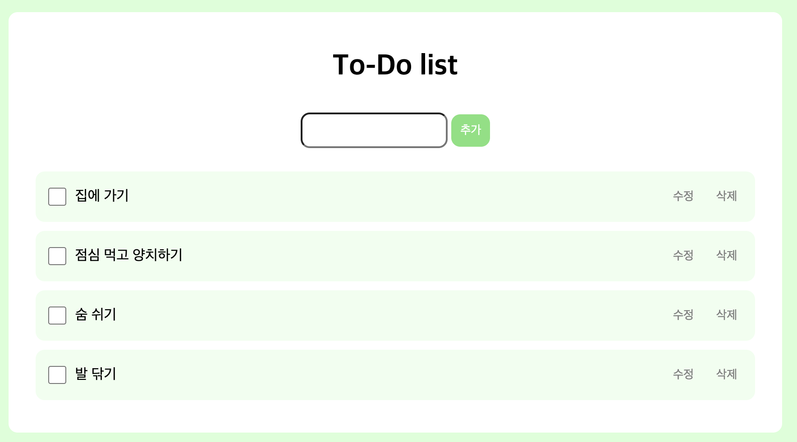
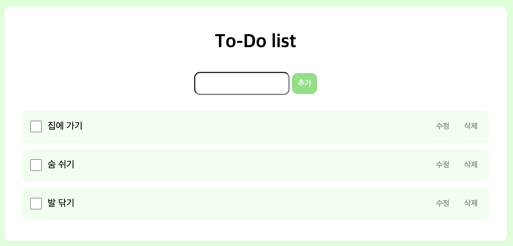
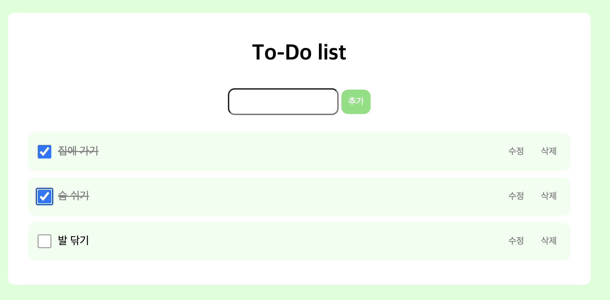

# 42gg 프론트엔드 온보딩 1단계

## 프로젝트 소개

- 42gg 프론트엔드 온보딩 1단계 과제 결과물입니다.
- Javascript, HTML, CSS로 기본적인 todo-list를 구현하였습니다.

## 기능

- todo 생성, 조회, 수정, 삭제 기능을 구현하였습니다.
- 완료 상태 체크 기능을 구현하였습니다.

- 할 일 추가

- 수정 및 수정 취소

- 수정 완료

- 삭제

- 완료 상태 체크
